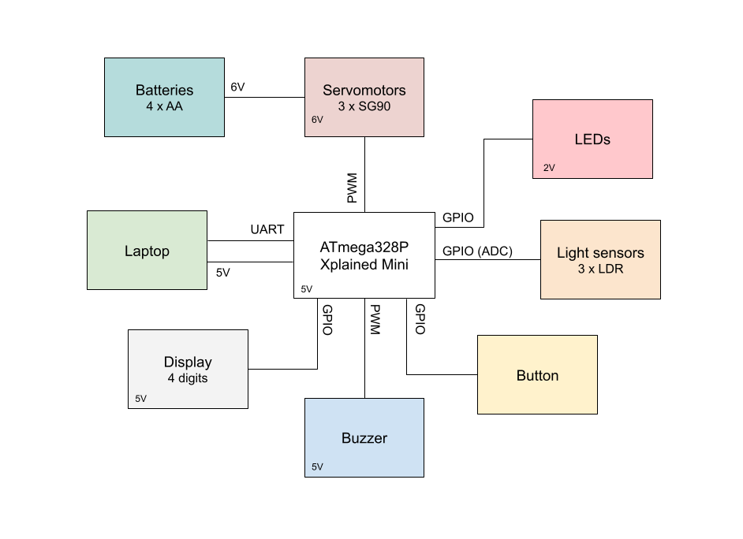
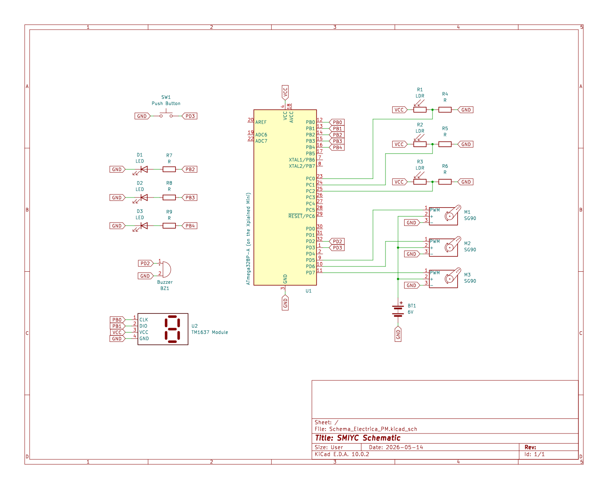
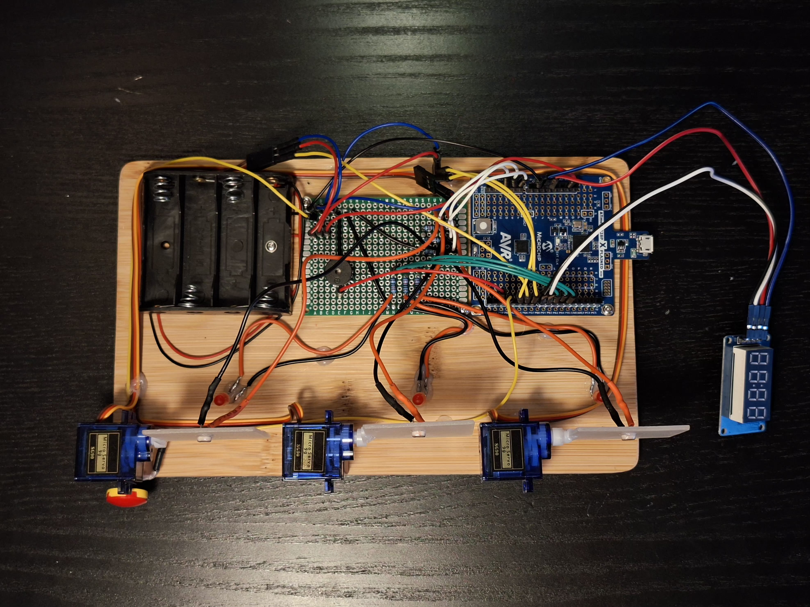
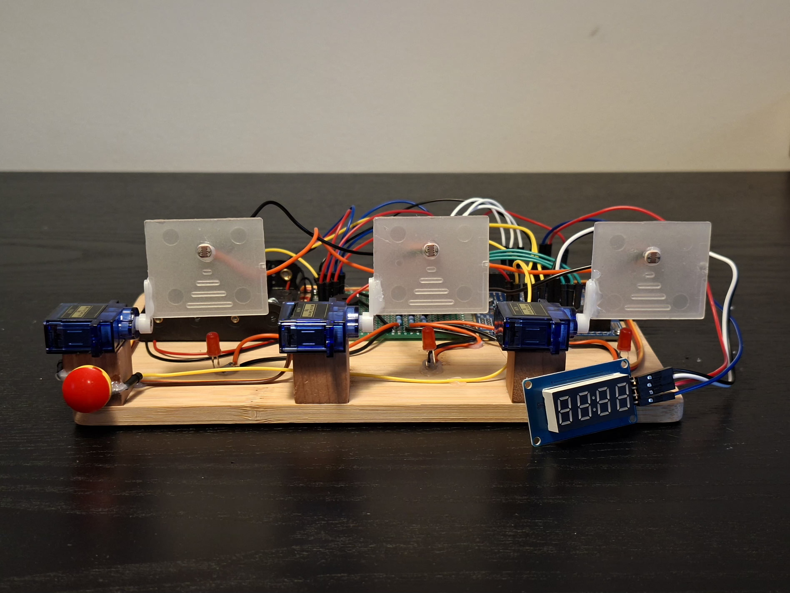
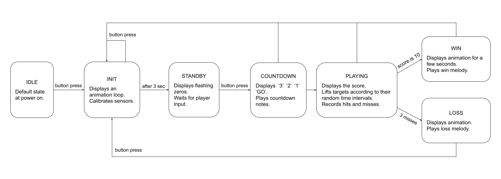

# Shoot Me If You Can

## Introduction

I wanted to make something with light sensors and motors, so I came up with the idea of a laser  
shooting game and designed it to test the player’s reflexes and aiming accuracy. The goal is to  
earn points by "hitting" the targets right when they appear. If the player takes too long and a  
target hides away, they lose a point. The game is over if this happens three times in a row.  
To win the game, the player has to reach a score of 10.  

The purpose of this project is to create interactive experiences and a good time for everyone  
playing. In order to achieve this, a 7-segment display, LEDs and buzzer will provide visual and  
audio feedback throughout the whole gameplay.  


## General Description

*Shoot Me If You Can* has an ATmega328P Xplained Mini at its core, a lightweight microcontroller  
board perfect for managing all the tasks needed: ADC conversions, interrupts, PWM signals, GPIO  
and UART for debugging through the laptop’s serial monitor.

The build has three servomotors that independently move three targets up and down, while each  
target has a photoresistor (LDR) that detects light level changes. There is also a 7-segment display  
with four digits that shows the score during the game, as well as some animations and a '3.. 2.. 1.. GO'  
sequence. Every game event is announced by a passive buzzer with unique sounds for target hits and  
misses, game start, win or loss.

### Game Flow:

1. All targets initially stand in a vertical position and the display starts an animation loop.  
The ATmega takes samples from the photoresistors to determine the reference light level  
of the room, then the servomotors lay down the targets, ready for game start. 

2. After the button is pressed, the targets start rising randomly. The microcontroller measures  
the light continuously (only while the targets are raised), each ADC conversion being compared  
with the reference level. In case of a hit, it commands the corresponding servomotor to lower  
the target, it activates the buzzer and it increases the player’s score. When the score reaches 10,  
the game ends, leading to the next phase. If a target was raised and it wasn’t hit in the first  
three seconds, it counts as a miss and the motor lowers it. At three consecutive misses, the game  
is over.

3. For both win or lose situations, the display shows a message, the buzzer makes a sound and all  
targets get into their vertical position.

### Block Diagram:




## Hardware Design

List of components:

  * ATmega328P Xplained Mini
  * TM1637 display module
  * 3 x SG90
  * 3 x LDR
  * 3 x Red LED
  * 3 x 10K resistors
  * 3 x 220R resistors
  * Passive buzzer
  * Push button

Schematic:



*Note: I made a custom symbol for the display module since KiCad doesn't have one.*

Top-down and front view of the (aesthetically) unfinished project:

   

I used a perfboard to solder the resistors, power sources, buzzer, LDRs, LEDs and a common GND  
for the ATmega and the batteries.  

>Important note:  
>The red button seen in the bottom-left corner is made with two Lego pieces glued on the push button.

## Software Design

**Environment**: PlatformIO

I chose to implement my project with Arduino (C++) to focus on the complex game logic and custom  
display animations. However, it still turned out to be non-trivial, requiring over 400 lines of code.  
The `Servo` library has functions for simple control over the assigned servomotors, using PWM  
signals to encode the desired angle a motor has to reach. The display has a module that implements  
an I2C-like protocol, which is done through regular digital pins (one for clock synchronization  
and another for data). All this is managed by the `TM1637Display` library.


**Table for libraries and their use cases**:

<table>
  <thead>
    <tr>
      <th>Name</th>
      <th>Function</th>
      <th>Usage and Description</th>
    </tr>
  </thead>
  <tbody>
    <tr>
      <td rowspan="7">Arduino.h</td>
      <td><code>millis()</code></td>
      <td>Tracks the current time to create non-blocking timers <br> for all time-based events.</td>
    </tr>
    <tr>
      <td><code>pinMode()</code></td>
      <td>Configures the hardware pins (button, LEDs, buzzer) as <br> either inputs (with pullup) or outputs.</td>
    </tr>
    <tr>
      <td><code>digitalRead()</code></td>
      <td>Reads the physical button state in order to start the <br> game or restart back to the initial state.</td>
    </tr>
    <tr>
      <td><code>digitalWrite()</code></td>
      <td>Controls the target LEDs, turning them on (HIGH) or <br> off (LOW) based on target state.</td>
    </tr>
    <tr>
      <td><code>analogRead()</code></td>
      <td>Captures voltage levels from the LDRs to detect laser <br> hits and reads noise from A5 (an analog pin that isn't <br> being used) for <code>randomSeed()</code>.</td>
    </tr>
    <tr>
      <td><code>tone()</code></td>
      <td>Outputs audio frequencies to the buzzer for audio <br>feedback ('GO' tone, hit sounds, melodies, etc.).</td>
    </tr>
    <tr>
      <td><code>random()</code></td>
      <td>Generates random timer intervals to keep the rising <br> timing of the targets unpredictable.</td>
    </tr>
    <tr>
      <td rowspan="2">Servo.h</td>
      <td><code>attach()</code></td>
      <td>Connects the <code>Servo</code> objects (motors) to their respective <br> hardware pins during <code>setup()</code>.</td>
    </tr>
    <tr>
      <td><code>write()</code></td>
      <td>Commands the servo motors to rotate to specific angles <br> (0 or 90) to physically lower or raise the targets.</td>
    </tr>
    <tr>
      <td rowspan="4">TM1637Display.h</td>
      <td><code>clear()</code></td>
      <td>Erases all current numbers/segments from the 7-segment <br> display.</td>
    </tr>
    <tr>
      <td><code>showNumberDec()</code></td>
      <td>Displays decimal integer values on the screen, useful <br> for showing the countdown (3..2..1) and the game score.</td>
    </tr>
    <tr>
      <td><code>setSegments()</code></td>
      <td>Sends raw byte patterns to the display for animations <br> and custom words like "GO"</td>
    </tr>
    <tr>
      <td><code>setBrightness()</code></td>
      <td>Sets the overall brightness level of the TM1637 display <br> hardware during initialization.</td>
    </tr>
  </tbody>
</table>


**Structure**: 

The program works as a finite-state machine, as shown in the diagram below. 




The whole code can be found in [this file](https://github.com/mateimitnei/ShootMeIfYouCan/blob/main/src/main.cpp) on GitHub.

Main structure, with iterative checks for the game and button states:

```cpp
// Global variables...
// Utility functions...
// State handlers...

void setup() {...}

void loop() {
    uint32_t now = millis();
    check_button_press(now);

    switch (game_state) {
        case INIT_STATE: init_state(now); break;
        case STANDBY_STATE: standby_state(now); break;
        case COUNTDOWN_STATE: countdown_state(now); break;
        case PLAYING_STATE: playing_state(now); break;
        case WIN_STATE: win_state(now); break;
        case LOSS_STATE: loss_state(now); break;
        default: break;
    }
}
```

When a button press is detected and the current phase is 'STANDBY', it means that the user wants  
to start playing, so the global state variable is set to 'COUNTDOWN'. If this is not the case and  
the current phase is not 'STANDBY' or 'INIT', it means that the player wants to restart the game,  
so a few global variables are reinitialized and the state is set to 'INIT'.


```cpp
void check_button_press(uint32_t now) {
    bool btn_reading = digitalRead(PIN_BUTTON);
    // Debounce check logic...

    if ((now - last_debounce_time) > debounce_delay) {
        if (btn_reading != btn_state) {
            btn_state = btn_reading;

            // Pressed button:
            if (btn_state == LOW) {
                // Start playing:
                if (game_state == STANDBY_STATE) {
                    lower_all_targets();
                    game_state = COUNTDOWN_STATE;
                    time_start_state = 0;
                }
                // (Re)start the game and calibrate sensors:
                else {
                    tone(PIN_BUZZER, 500, 300);
                    game_init();
                    time_start_state = now;
                }
            }
        }
    }
}
```


The **light sensor calibration** happens in the 'INIT' state, at the end of which the global variable  
`target[i].reference_light` is given the mean value of the light level (measured during a  
second of continuous sampling). This reference is then used together with the constant variable  
`light_difference` to check the sensors' readings during the 'PLAY' state.

```cpp
// Sample for a second
if (elapsed >= 1000 && elapsed < 2000) {
    for (int i = 0; i < 3; i++) {
        targets[i].reference_light += analogRead(PIN_LDR[i]);
    }
    calibration_samples++;
}

// Mean values
if (elapsed >= 2000 && calibrated == 0) {
    for (int i = 0; i < 3; i++) {
        targets[i].reference_light /= calibration_samples;
    }
    calibrated = 1;
}
```

I needed a lot of time-tracking variables, so I initially used `millis()` every time I calculated  
an interval. As an optimization, I kept a single `millis()` call per loop, passing the timestamp  
as a parameter to all handlers. This way I eliminated computational and logical redundancy.


As a novelty element, I created custom animations for the 4-digit-7-segment display:
  * **The calibration loop** - has 12 frames corresponding to the 12 outer segments.  
  Each frame, two consecutive segments are turned off, while the rest of the outline stays lit.  
  This way it creates a rotating movement to the right.
  * **The winning animation** - with the number 10 initially displayed in the center, it shifts it  
  left and right creating a smooth movement. The middle position's duration is much shorter,  
  its role being to transition the number from a side to the other.
  * **The losing animation** - consists of 4 steps: 0, 0o, 0o_ and nothing (one must imagine these  
  as squared, 7-segment shapes). The idea is to create a sad shrinking visual, accompanied by  
  the buzzer's notes.


## Results

The project went according to plan. The final result is exactly what I had in mind when I came up  
with the idea of a target shooting game.

Demo video: [SOON]

## Conclusions

This was a really enjoyable experience for me, mostly because I got to solder for the first time  
at home. I'm happy with how it all turned out.

## Download

[GitHub Repository](https://github.com/mateimitnei/ShootMeIfYouCan)


## Bibliography/Resources

* [Making and using a light sensor](https://www.arnabkumardas.com/arduino-tutorial/ldr-light-sensor/)
* [ATmega328P documentation](https://ww1.microchip.com/downloads/en/DeviceDoc/Atmel-7810-Automotive-Microcontrollers-ATmega328P_Datasheet.pdf)
* [SG90 servo tutorial](https://pcbsync.com/sg90-micro-servo-arduino/)
* [Detailed tutorial for the TM1637 display](https://www.instructables.com/How-to-Use-the-TM1637-Digit-Display-With-Arduino/)

